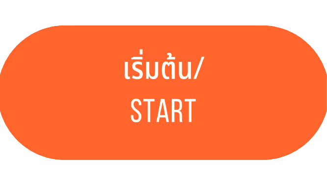
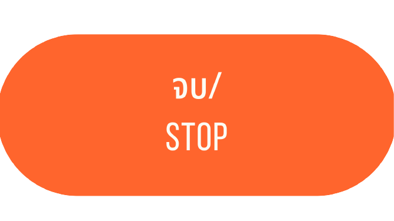
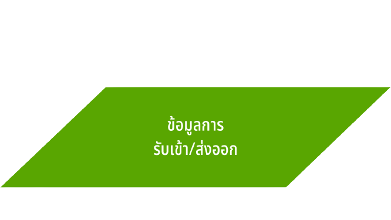

# Flowchart

---

## Flowchart คืออะไร?
Flowchart หรือ ผังงาน คือ แผนผัง(Diagram) ชนิดหนึ่ง ที่ใช้อธิบายการทำงานของระบบหรือโปรแกรม  
ว่าระบบนี้ทำงานอย่างไร เริ่มจากไหน และจบที่ไหน เป็นแบบ Step by step  
โดยใช้สัญลักษณ์ (Symbol) แทนขั้นตอน คำอธิบาย ข้อความ หรือคำพูด ในอัลกอริทึม (Algorithm)

---

## สัญลักษณ์ใน Flowchart
<ol>
<li><b>Beginning block :</b> วาดลงไปเป็นอันแรกเลยของไดอะแกรม ใช้แสดงถึงจุดเริ่มต้นของ Flowchart</li>

 

<li>Termination block: วาดเป็นจุดสุดท้ายของไดอะแกรม ใช้แสดงถึงจุดสิ้นสุดของ Flowchart</li>

 

<li>Input/Output (data) block: แสดงถึงขั้นตอนที่มีการ รับข้อมูลเข้า หรือ ส่งข้อมูลออก เช่นการ กรอกชื่อ</li>

 

<li>Process block: เป็นสัญลักษณ์ที่ใช้แทนขั้นตอนที่เป็นกระบวนการทำงาน ประมวลผล หรือการทำอะไรบางอย่างกับข้อมูล เช่นการเอาตัวเลขไปคำนวน</li>
<li>Decision block: เป็นสัญลักษณ์ที่ใช้เมื่อมีการตัดสินใจหรือทางเลือกเกิดขึ้น แบ่งได้เป็น
<ul>
<li>ตัดสินใจว่าใช่หรือไม่ใช่</li>
<li>มีทางเลือกหลางทางเลือก</li>
</ul>
</li>
<li>Connector: ใช้เชื่อมส่วนหนึ่งของ Flowchart กับอีกส่วน ใช้ในกรณีมีเส้นที่เชื่อมเยอะเกินไป แล้วดูยุ่งเหยิง</li>
<li>Flow line: ใช้ในการบอกลำดับการทำงาน จากขั้นหนึ่งไปสู่อีกขั้นหนึ่ง</li>
</ol>

---

## รูปแบบการเขียนและตัวอย่าง Flowchart
<ol>
<li>การทำงานแบบตามลำดับ(Sequence)</li>
  รูปแบบการเขียน Flowchart ที่ง่ายที่สุดคือ เขียนให้ทำงานจากเริ่มต้น ถึง จุดสุดท้าย โดยเขียนคำสั่งเป็นบรรทัด และทำทีละบรรทัดจากบรรทัดบนสุดลงไปจนถึงบรรทัดล่างสุด ไม่มีให้ตัดสินใจหรือทำขั้นตอนซ้ำ
<li>การเลือกกระทำตามการตัดสินใจหรือเงื่อนไข(Decision or Selection)</li>
   เป็นการเขียน Flowchart โดยมีขั้นตอนที่ผู้ใช้จะต้องตัดสินใจ ว่าจะเลือกเส้นทางไหน หรือมีเงื่อนไขมากำหนดเส้นทาง โดยปกติจะมีอยู่ 2 ทางเลือกคือ เงื่อนไขเป็นจริง และ เงื่อนไขเป็นเท็จ  
  แต่ก็จะมีกรณีที่ซับซ้อนมากขึ้นอย่าง การมีหลายทางเลือก, มีเงื่อนไขหลายชั้น เป็นต้น
<li>การทำซ้ำ(Repetition or Loop)</li>
  เป็นการเขียน Flowchart ที่มีการทำกระบวนการหนึ่งหลายครั้ง โดยมีเงื่อนไขในการควบคุมว่าจะให้ทำซ้ำเมื่อเงื่อนไขเป็นอย่างไร? เช่น ทำอีกครั้งเมื่อเงื่อนไขเป็นจริง หรือ ทำอีกครั้งเมื่อเงื่อนไขเป็นเท็จ   
  ทำงานร่วมกับ Decision block ในการเช็คเงื่อนไข
</ol>
