# Raptor

---

## การติดตั้งโปรแกรม Raptor Flowchart ในระบบปฏิบัติการ Windows
<ol>
<li>ไปที่ลิงก์ <a href="https://raptor.martincarlisle.com/">Raptor Flowchart</a></li>

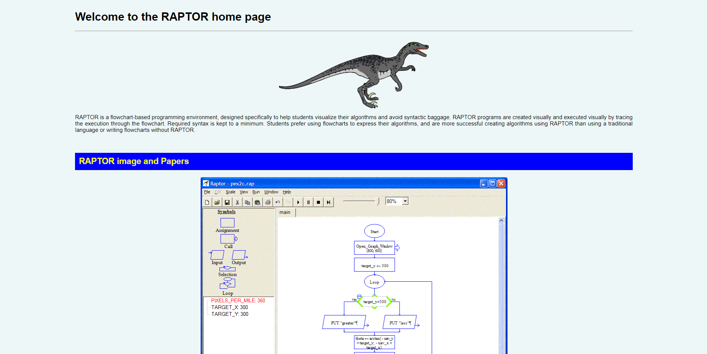 

<li>เลื่อนลงไปที่ Download RAPTOR แล้วกด Download latest version</li>

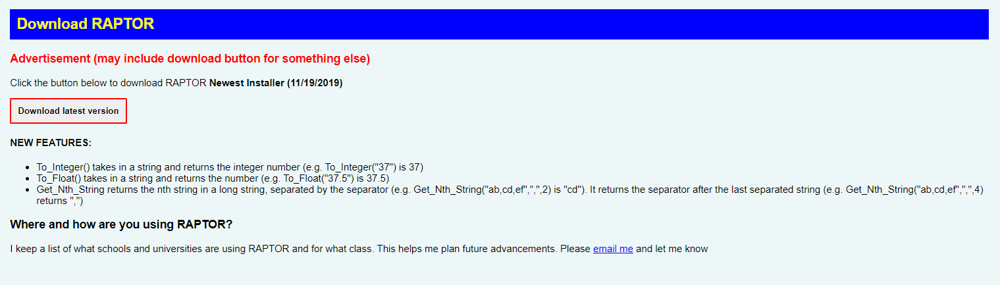 

<li>กด next</li>

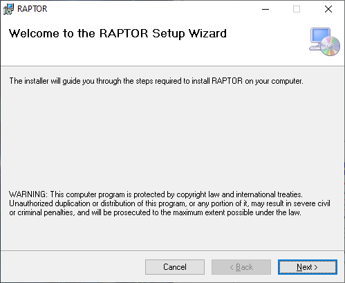 

<li>เลือก folder ที่จะติดตั้งโปรแกรมแล้วกด next</li>

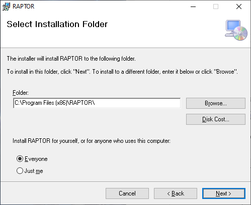 

<li>กด next อีกทีเพื่อยืนยันการติดตั้ง</li>

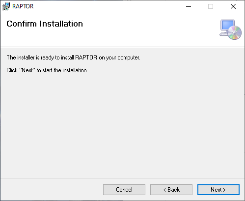 

<li>ติดตั้งเรียบร้อย กด close เพื่อปิด installer</li>

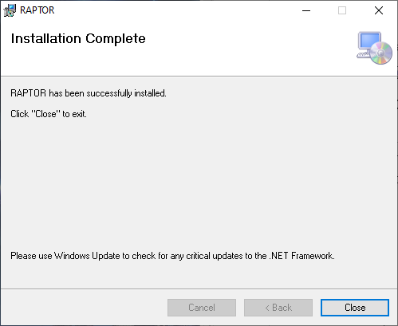 

</ol>

## การติดตั้งโปรแกรม Raptor Flowchart ในระบบปฏิบัติการ MacOS
ให้ใช้เว็บไซต์ Lucid Chart แทน โดยเข้าได้ที่เว็บไซต์ <a href="https://www.lucidchart.com/">Lucidchart</a> สมัครสมาชิกและล็อกอินเข้าสู่ระบบ (จะมีการสอนใช้เว็บไซต์แยกเป็นรายกลุ่มไป)

## ทำความรู้จักกับ Raptor
เรามาทำความรู้จักกับ Raptor กันซักหน่อยดีกว่าว่ามีแนวทางการใช้อะไรบ้าง แต่ว่าก่อนอื่นเลย Raptor จะบังคับให้เซฟไฟล์ก่อน หรือถ้าไม่แจ้งเตือนอะไร เราก็จะเซฟไฟล์ไว้ก่อนอยู่ดี
* หน้าตาโปรแกรม

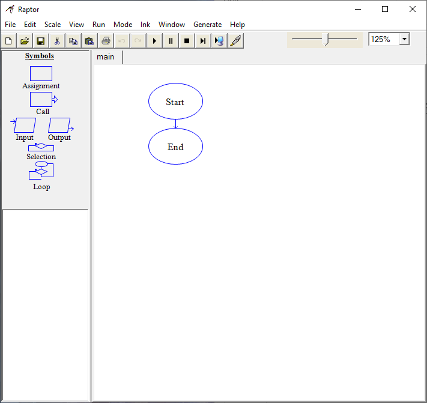 

* การนำสัญลักษณ์ออกมาใช้แบบที่ 1
> คลิกซ้ายที่สัญลักษณ์ที่ต้องการครั้งดียว แล้วไปคลิกซ้ายอีกที ณ จุดที่เราต้องการใช้ 

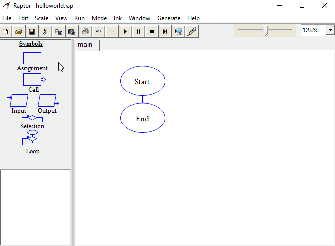 

* การนำสัญลักษณ์ออกมาใช้แบบที่ 2
> กดคลิกซ้ายแล้วลากมายังจุดที่เราต้องการจะให้สัญลักษณ์นั้นไปอยู่

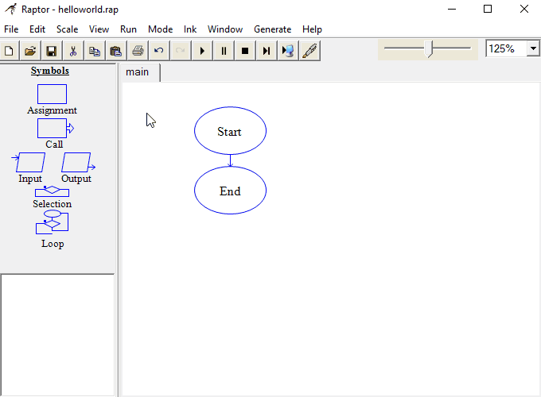 

* การสร้างตัวแปรและใส่ค่าให้ตัวแปร
> รับ input ไปเก็บในตัวแปร x ใน prompt และใส่เป็น string เปล่า (“”) และ variable จะใส่เป็นชื่อตัวแปรที่เราจะใช้เก็บค่าของinput

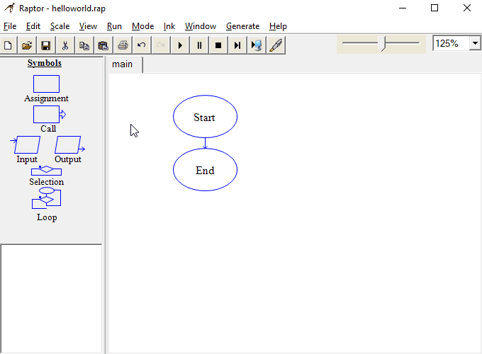 

> ทดสอบการทำงานดูจะได้แบบนี้

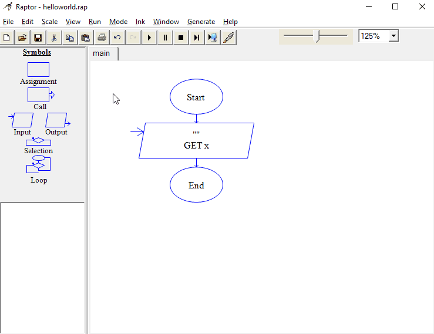 

* การแสดงผลข้อความ
> ลองเพิ่ม output ดูให้ส่งออกคำว่า “ Hello world” เราจะใส่ “ ” ทั้งหน้าและหลัง เพราะเราต้องการจะส่ง string ออกมา

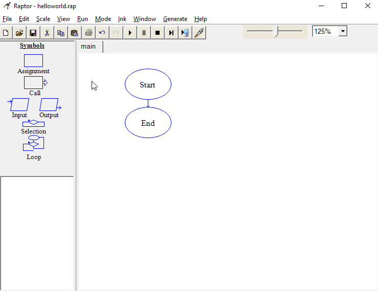 

> เริ่มการทำงานก็จะได้ Output ออกมาในหน้าต่าง Console 

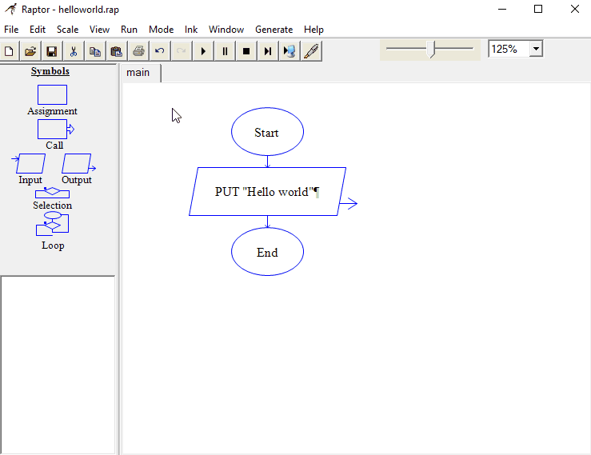 

## ตัวอย่างโจทย์ Raptor
### 1. เขียน Flowchart ให้แสดงค่าที่รับ Input เข้ามา
> ใน Flowchart นี้ รับ Input ไปไว้ในตัวแปร a แล้ว Output ออกเป็นค่าของตัวแปร a

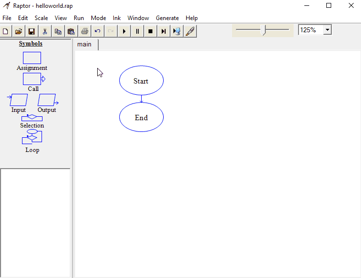 

> เมื่อเริ่มการทำงานก็จะได้หน้าตาแบบนี้เลย

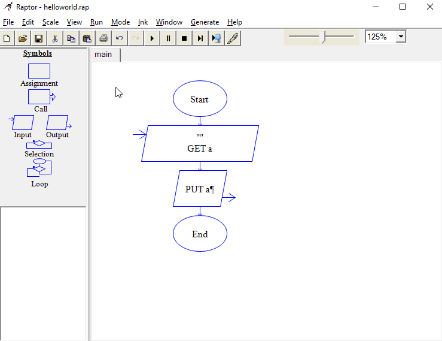 

### 2. เขียน Flowchart ให้รับค่า Input เป็นจำนวนเต็ม จากนั้นนำค่าไปคูณด้วย 2 แล้วแสดงผลออกมา
> ตั้ง Input เพื่อรับค่าของจำนวนเต็มในสัญลักษณ์ Assignment คือเราประกาศว่า ให้ number มีค่าเป็น number * 2

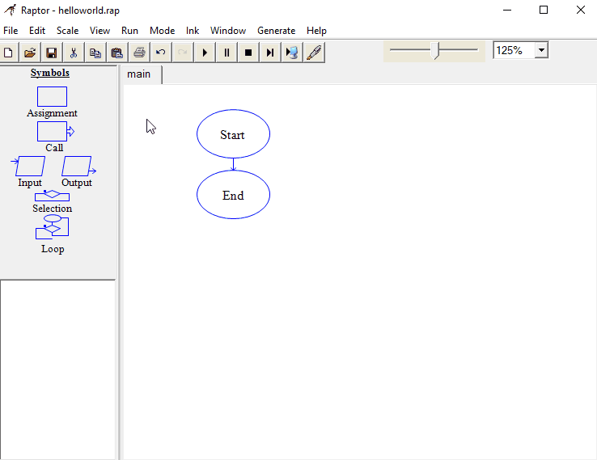 

> เมื่อเริ่มการทำงานแล้วใส่ Input เป็น 6 จะได้ Output เป็น 12

 

### 3. เขียน Flowchart ให้ตรวจสอบว่าเงินที่ได้รับมาพอที่จะซื้อเรือดำน้ำราคา 50 บาทหรือไม่?
พี่อยากจะซื้อเรือดำน้ำของเล่นราคา 50 บาท แต่พี่ไม่มีเงิน เลยอยากจะขอยืมเงินน้อง ๆ ก่อน ให้กันตามศรัทธาได้เลย ข้อนี้จะให้เขียน Flowchart รับinputเป็นจำนวนเงินที่น้องๆ จะให้พี่ยืม แล้วเช็คว่าจำนวนเงินที่พี่ได้มานั้น พอจะซื้อเรือดำน้ำของเล่นได้ไหม ถ้าซื้อได้ให้ output เป็นคำว่า "yes" ถ้าไม่ได้ให้ออกเป็นคำว่า "no"

> รับ Input จำนวนเงินที่น้องๆ จะให้พี่ยืมเก็บไว้ในตัวแปรชื่อว่า money

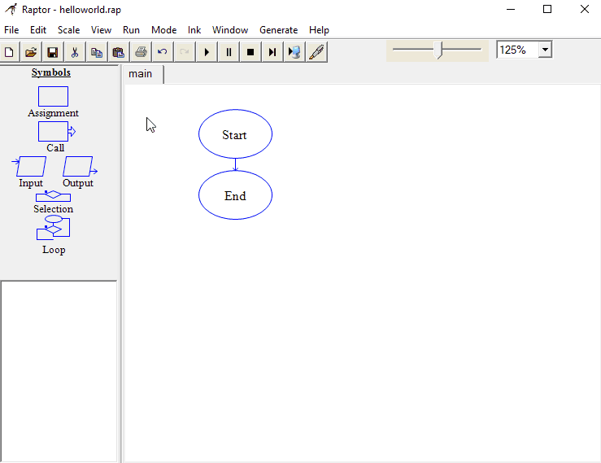 

> ใช้ Selection โดยเพิ่มเงื่อนไข ถ้า money >= 50 เป็นจริง จะเลือกเส้นทาง yes ถ้า money >= 50 เป็นเท็จ จะไปเส้นทาง no

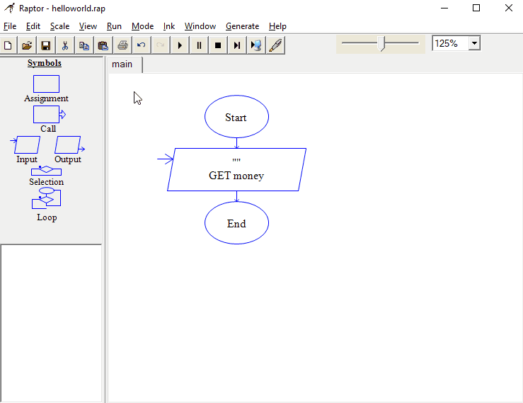 

> เพิ่ม Output ให้ทั้งสองเส้นทาง ถ้าเป็นจริงจะแสดงผล "yes" เป็นเท็จจะแสดงผล "no"

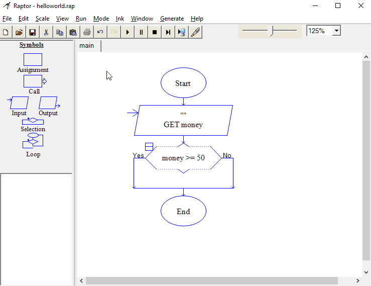 

> ลองรันแล้วใส่ Input เป็น 60 จะพบว่า money >= 50 เป็นจริงจึงแสดงผลเป็น "yes"

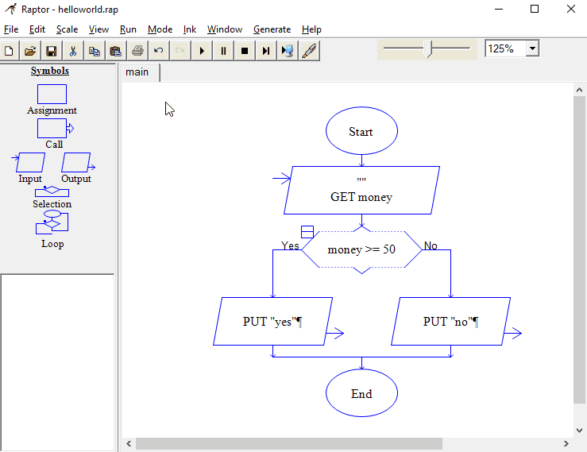 

>ถ้าเราใส่ Input เป็น 40 money >= 50 จะเป็นเท็จจะแสดงผลเป็น "no"

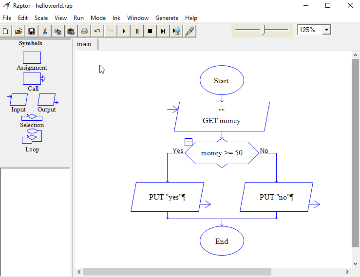 

### 4. เขียน Flowchart ให้แสดงผลเลขตั้งแต่ 0 ถึง 5 โดยเมื่อแสดงผลหมดแล้วให้ขึ้นว่า "end"
> อันดับแรก กำหนดค่าตัวแปรขึ้นมาหนึ่งตัว โดยให้มีค่าเท่ากับ 0

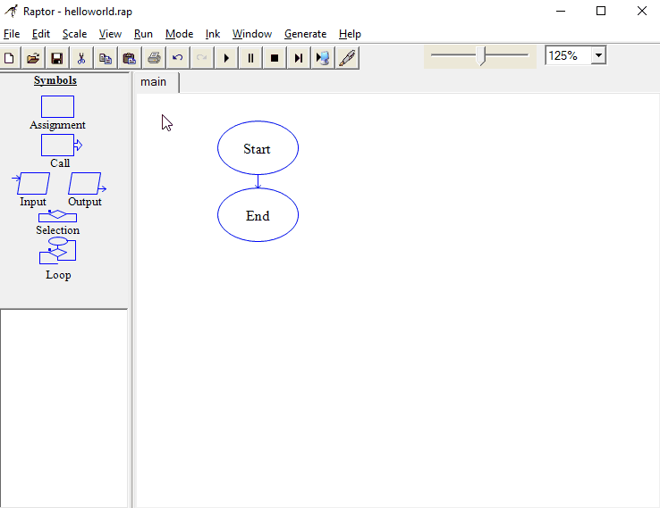 

> แล้วเพิ่ม Loop โดยให้แสดงผลค่า x ออกมาทุกครั้ง

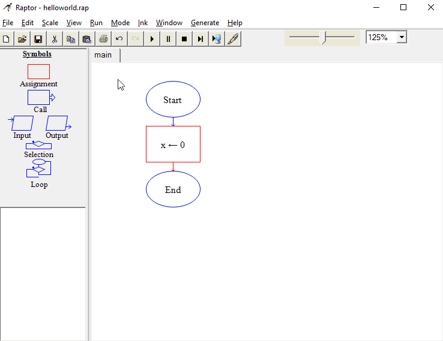 

> สัญลักษณ์ Loop จะทำงานร่วมกับ Selection หลังจากแสดงผลค่า x ออกมา ถ้า x มีค่าไม่เท่ากับ 5 จะให้ x = x+1 แล้ววนลูป แต่ถ้า x มีค่าเป็น 5 ให้ออกจากลูปทันที

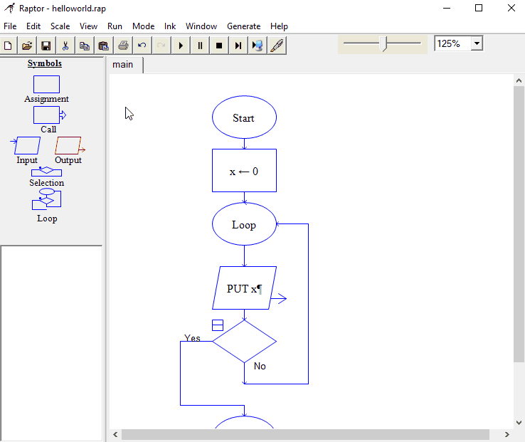 

> ทำการแสดงผลคำว่า "end" เมื่อ Output 5 เสร็จสิ้น

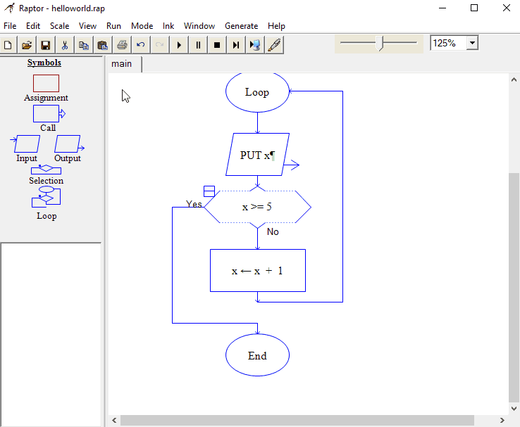 

>เมื่อเริ่มการทำงานก็จะได้หน้าตาแบบนี้เลย

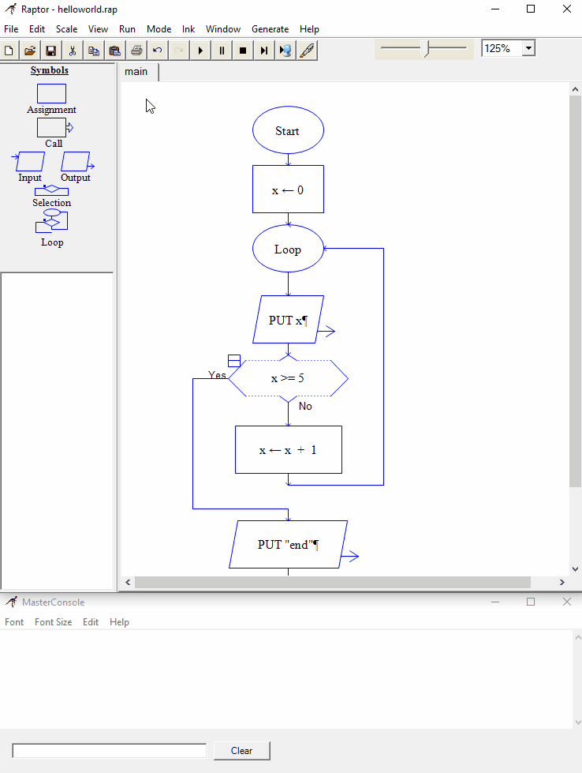 

